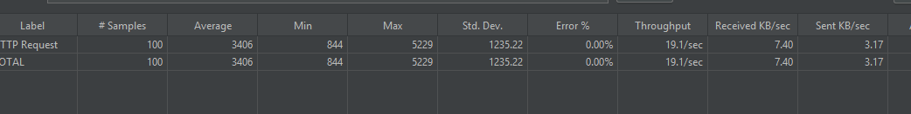
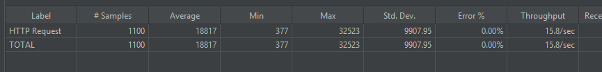

# Proyecto de Detección de Mutantes - Parcial Magneto

**Nombre**: Fabio Escudero  
**Comisión**: 3K10  
**Universidad**: Universidad Tecnológica Nacional

---

## Introducción

Magneto busca reclutar mutantes para enfrentarse a los X-Men y te ha encargado la creación de un sistema que permita detectar si un humano es mutante a partir de su secuencia de ADN. Este proyecto consiste en desarrollar un programa que detecte mutantes mediante un análisis de las secuencias genéticas.

El proyecto implementa una función clave con la siguiente firma:

```java
boolean isMutant(String[] dna);
```

## URL de RENDER

//POST

https://integradormutante.onrender.com/mutant

//GET

https://integradormutante.onrender.com/stats

## Funcionamiento del Programa
El programa recibe como entrada un array de Strings que representa cada fila de una matriz de (NxN) con la secuencia de ADN. Las letras que componen estos strings solo pueden ser: A, T, C, G, que corresponden a las bases nitrogenadas del ADN.

El ADN se considera mutante si se encuentran más de una secuencia de cuatro letras iguales consecutivas, en cualquiera de las siguientes direcciones:

- Horizontal
- Vertical
- Diagonal (principal y secundaria)

## Ejecución del Algoritmo
1. Recepción del ADN: El usuario ingresa una matriz NxN que representa la secuencia de ADN.
2. Verificación: Se aplica una lógica para detectar si existen secuencias consecutivas de cuatro letras iguales. Esta verificación se realiza recorriendo:
   - Las filas de la matriz.
   - Las columnas de la matriz. 
   - Las diagonales principales y secundarias.
3. Resultado: Si se encuentran más de una secuencia válida, el ADN se clasifica como mutante. De lo contrario, se clasifica como humano.
   
## Lógica Utilizada
### Análisis del ADN
   El análisis se basa en un recorrido por cada una de las direcciones posibles en la matriz. La función isMutant recorre la matriz en busca de secuencias consecutivas de cuatro letras iguales en:

- Filas: Verificamos si hay secuencias de cuatro letras iguales en cada fila.
- Columnas: Analizamos cada columna de la matriz en busca de secuencias. 
- Diagonales: Verificamos tanto las diagonales principales (de izquierda a derecha) como las diagonales secundarias (de derecha a izquierda).

Para optimizar el rendimiento, se realiza una verificación temprana: en cuanto se detectan más de una secuencia válida, se determina que el ADN es mutante y el análisis se detiene.

## Endpoints
El sistema cuenta con dos endpoints principales para interactuar con el análisis de ADN:

- POST /mutant

Recibe un JSON con la matriz de ADN para verificar si es mutante. El formato del request debe ser el siguiente:

```json
{
    "dna": [
        "ATGCGA",
        "CAGTGC",
        "TTATGT",
        "AGAAGG",
        "CCCCTA",
        "TCACTG"
    ]
}
```
Si el ADN es mutante, retorna un 200 OK. Si no es mutante, retorna un 403 Forbidden.

- GET /stats

Devuelve un JSON con estadísticas de los ADN analizados, incluyendo la cantidad de mutantes y humanos, y el ratio entre ambos. Ejemplo de respuesta:


```json
{
"count_mutant_dna": 40,
"count_human_dna": 100,
"ratio": 0.4
}
```

## Ejemplos de ADN
A continuación se muestran ejemplos de ADN mutante y no mutante, para realizar pruebas.

### Ejemplo de Matriz Mutante:

```json
{
    "dna": [
        "ATGCGA",
        "CAGTGC",
        "TTATGT",
        "AGAAGG",
        "CCCCTA",
        "TCACTG"
    ]
}
```
En este ejemplo, se pueden observar secuencias mutantes en la fila, columna y diagonales.

### Ejemplo de Matriz No Mutante:

```json
{
    "dna": [
        "ATGGTG",
        "GTCTTA",
        "AATTGG",
        "ACTAGT",
        "GGATTC",
        "AGGCAA"
    ]
}
```
En este ejemplo, no se encuentran suficientes secuencias consecutivas para clasificar el ADN como mutante.

## Pruebas con JMeter

### 100 peticiones



## 1000 peticiones



